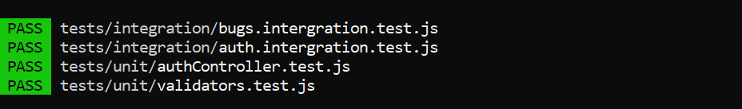
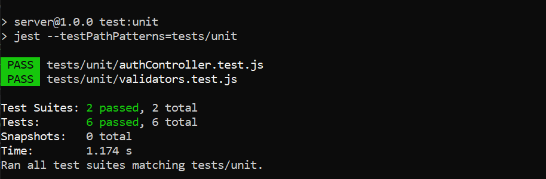
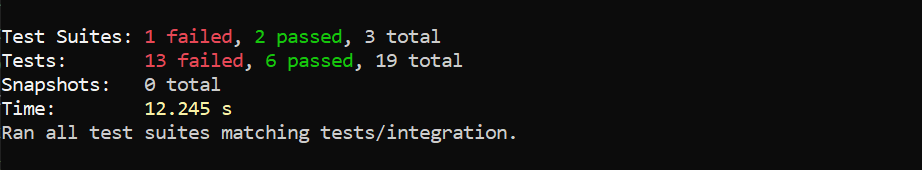

# Testing and Debugging MERN Applications

This project demonstrates how to implement comprehensive testing strategies in a MERN stack application. It includes unit tests, integration tests, end-to-end tests, and debugging techniques used throughout the client and server environments.

## Project Overview

This project focuses on:
1. Setting up testing environments for React (client) and Node.js/Express (server)
2. Writing unit tests for components, utility functions, and server logic
3. Creating integration tests for API endpoints
4. Running end-to-end tests using Cypress
5. Applying debugging techniques in both client and server
6. Improving testing coverage and ensuring reliability

## Project Structure

```
mern-testing/
├── README.md
├── package.json                # root scripts to run client & server
├── jest.config.js              # Jest configuration
├── server/
│   ├── package.json
│   ├── src/
│   │   ├── index.js            # starts server
│   │   ├── app.js              # express app
│   │   ├── controllers/
│   │   │   ├── authController.js
│   │   │   └── bugsController.js
│   │   ├── models/
│   │   │   └── Bug.js
│   │   │   ├── User.js
│   │   ├── routes/
│   │   │   ├── auth.js
│   │   │   └── bugs.js
│   │   ├── middleware/
│   │   │   ├── authMiddleware.js
│   │   │   └── errorHandler.js
│   │   └── utils/
│   │   │   ├── auth.js
│   │   │   └── validators.js   # unit-tested helper functions
│   └── tests/
│       ├── unit/
│       │   ├──authController.test.js
│       │   └── validators.test.js
│       └── integration/
│       │   ├── auth.intergration.test.js
│       │   ├── bugs.integration.test.js
│       └── └── posts.test.js
└── client/
    ├── package.json
    ├── index.html
    └── src/
        ├── main.jsx
        ├── App.jsx
        ├── api.js              # API wrappers
        ├── components/
        │   ├── BugForm.jsx
        │   ├── BugList.jsx
        │   ├── BugItem.jsx
        │   └── ErrorBoundary.jsx
        └── __tests__/
        │   ├── BugForm.test.jsx
        │   └── BugList.integration.test.jsx
        └── cypress/            


```

## Installation & Setup
1. Clone the Repository
2. Install Server Dependencies
   ```
   cd server
   npm install
   ```
3. Install Client Dependencies
   ```
   cd ../client
   npm install
   ```
4. Start the Application
   ```
   npm run dev
   ```
5. Set up the test database:   
# In the server directory
   ```
   npm run setup-test-db
   ```
6. Run the tests:
   ```
   # Run all tests
   npm test
   
   # Run only unit tests
   npm run test:unit
   
   # Run only integration tests
   npm run test:integration
   
   # Run only end-to-end tests
   npm run test:e2e

## Testing Approach & Coverage Explanation
✔ Unit Testing
✔ Integration Testing
✔ End-to-End Testing
✔ Code Coverage
Run coverage
```
npm test -- --coverage
```

## Debugging Techniques Used

### Client-Side Debugging

 Developer Tools
- Logging using console.log() for component state and props
- Error boundaries to catch rendering issues
- Mock API debugging using Testing Library debug helpers

### Server-Side Debugging

- Node.js inspector (node --inspect)
- Logging middleware for API requests
- ErrorHandler middleware for tracking exceptions
- MongoDBMemoryServer that helps isolate DB errors during tests

### Cypress Debugging

- .debug() and .pause() commands
- Automatic DOM snapshots
- Network request logging and failure tracing


## Screenshots
### Server-side tests





### Client-side tests

## Requirements

- Node.js (v18 or higher)
- MongoDB (local installation or Atlas account)
- npm or yarn
- Basic understanding of testing concepts

## Testing Tools

- Jest: JavaScript testing framework
- React Testing Library: Testing utilities for React
- Supertest: HTTP assertions for API testing
- Cypress/Playwright: End-to-end testing framework
- MongoDB Memory Server: In-memory MongoDB for testing

## Resources

- [Jest Documentation](https://jestjs.io/docs/getting-started)
- [React Testing Library Documentation](https://testing-library.com/docs/react-testing-library/intro/)
- [Supertest Documentation](https://github.com/visionmedia/supertest)
- [Cypress Documentation](https://docs.cypress.io/)
- [MongoDB Testing Best Practices](https://www.mongodb.com/blog/post/mongodb-testing-best-practices) 